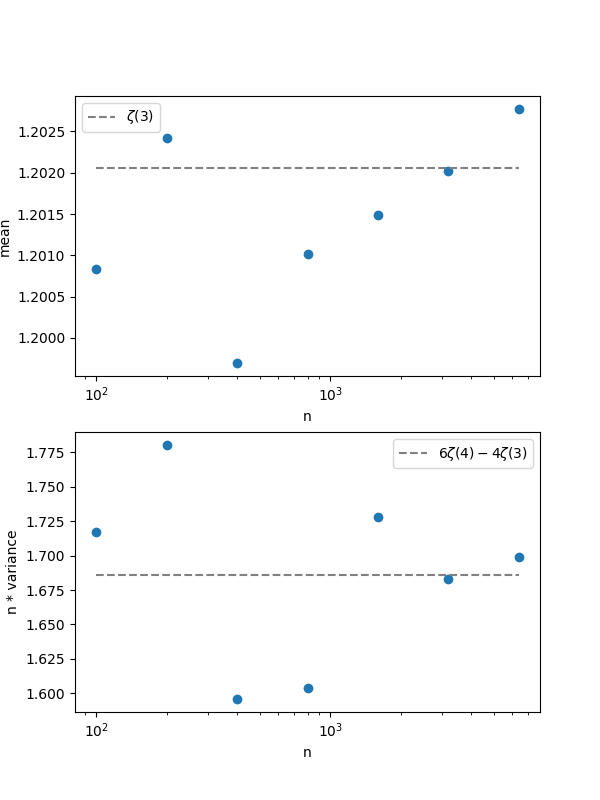

# randomSMT

ランダムグラフ上の最小全域木の和の期待値が$\zeta(3)$に収束することを確認するC++のコード

$n$頂点のランダムグラフの最小全域木の和の確率変数を$T_{n}$とおくと、
- $\lim\mathbb{E}[T_{n}]=\zeta(3)$
- $\lim n\cdot\mathrm{Var}(T_{n})=6\zeta(4)-4\zeta(3)$

参考文献
- [Wikipedia](https://en.wikipedia.org/wiki/Minimum_spanning_tree#MST_on_complete_graphs)
- [Concentration Inequalities: A Nonasymptotic Theory of Independence](https://oxford.universitypressscholarship.com/view/10.1093/acprof:oso/9780199535255.001.0001/acprof-9780199535255)
    - この本は集中不等式を取り扱っていて、その中でランダムグラフの最小全域木の和に関する分散を上から抑えることを行っている。

## Algorithm
実装の流れ
1. $n$頂点のランダムグラフを生成する。グラフは無向グラフで自己ループはなく、各辺重みは$[0,1]$区間からランダムに選ぶ。
2. このグラフに対してKruskal法で最小全域木の重み和を計算する。Kruskal法にはUnionFindを用いている([`unionfind.hpp`](unionfind.hpp)を参考のこと)。

## Compile and run
```bash
make
./run 1000 100 > mst.txt
```
コマンドライン引数
- `n`: ランダムグラフの頂点数(上の例だと`n=1000`)
- `n_iter`: ランダムグラフを何回生成させるか(上の例だと`n_iter=100`)

## Result
100頂点から3200頂点まで和を計算してみる。
```bash
./run 100 1000 > data/mst100.txt
./run 200 1000 > data/mst200.txt
./run 400 1000 > data/mst400.txt
./run 800 1000 > data/mst800.txt
./run 1600 1000 > data/mst1600.txt
./run 3200 1000 > data/mst3200.txt
```

$\mathbb{E}[T_{n}]$と$n\cdot\mathrm{Var}(T_{n})$の$n$依存性をそれぞれ眺めてみる。
